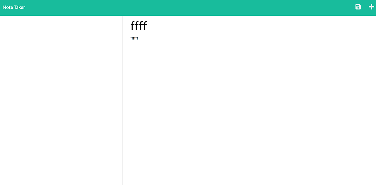

# Note-Taker

## Description

This fancy little app lets the user store notes on the site.

## Features

User can input a title for the note and text and when they click add it will be added to the list
of notes. When they click save the notes will remain on the page even after leaving and returning.

## Installation

Run NPM install to install inquirer and any required modules

## Links

<a href="https://vilas-izquierdo.github.io/Note-Taker/">Deployed Page</a>

<a href="https://github.com/vilas-izquierdo/Note-Taker">GitHub</a>